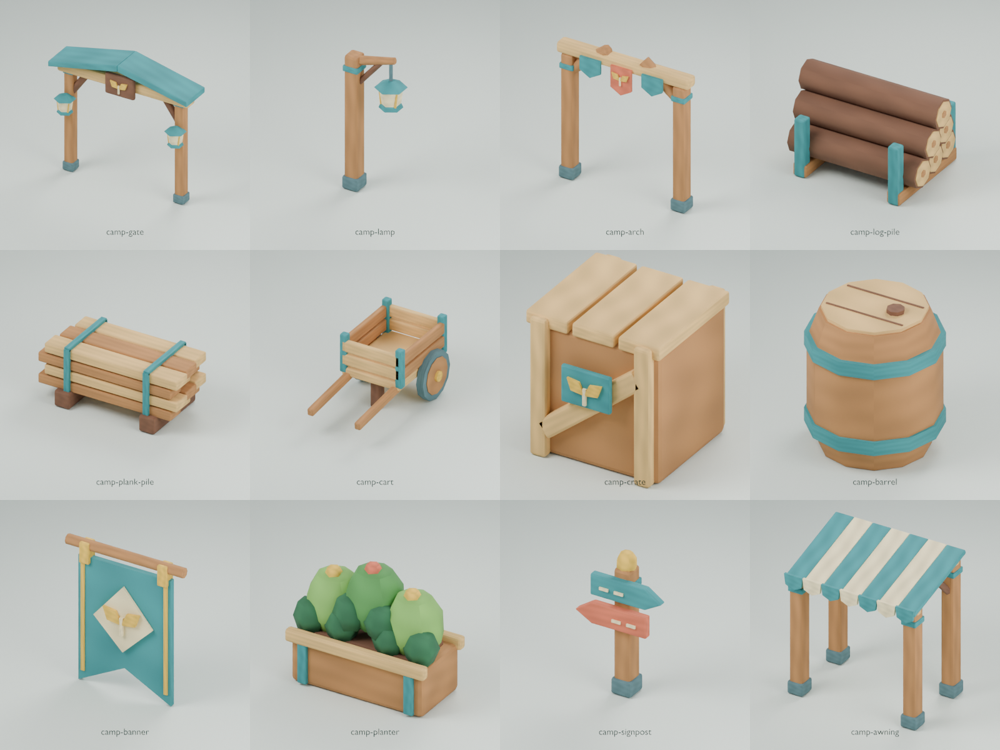

# Accessoires modulaires du camp

Cette bibliothèque contient 12 modèles originaux générés dans Blender. Elle utilise les couleurs et l’atlas existants de Slopfarm.

La direction actuelle privilégie une industrie forestière lumineuse. La [bibliothèque industrielle](industry-library.md) fournit les convoyeurs, les machines et les échoppes correspondantes.

Les piles, le chariot, la caisse, le tonneau et l’auvent complètent les zones industrielles de stockage et de vente.



## Catalogue

Chaque nom correspond à un fichier `.glb` dans ce dossier. Le budget maximal est de 2 500 triangles par modèle.

| Modèle            | Triangles | Silhouette et usage                                             |
| ----------------- | --------: | --------------------------------------------------------------- |
| `camp-gate`       |     1 372 | Portail à toit pointu, lanternes et enseigne à motif de pousse. |
| `camp-lamp`       |       488 | Lampadaire à bras incliné et lanterne hexagonale.               |
| `camp-arch`       |       896 | Arche de quartier avec branches obliques et trois fanions.      |
| `camp-log-pile`   |     1 392 | Six rondins dans un râtelier ouvert.                            |
| `camp-plank-pile` |     1 584 | Douze planches sur patins avec deux sangles turquoise.          |
| `camp-cart`       |     2 104 | Chariot à deux roues, caisse ouverte et longs brancards.        |
| `camp-crate`      |     1 232 | Caisse empilable avec renforts diagonaux et étiquette.          |
| `camp-barrel`     |       316 | Tonneau bombé, cerclages turquoise et bouchon.                  |
| `camp-banner`     |       340 | Bannière suspendue à deux pointes avec motif de pousse.         |
| `camp-planter`    |     1 380 | Jardinière de camp avec feuillage et fleurs.                    |
| `camp-signpost`   |       676 | Panneau à deux flèches opposées et couronnement doré.           |
| `camp-awning`     |     2 420 | Auvent ouvert à quatre poteaux et toile rayée à festons.        |

La bibliothèque totalise 14 200 triangles. Les 12 GLB occupent 6 951 992 octets, atlas intégré compris.

## Conventions d’intégration

- Chaque accessoire contient un seul maillage statique et une seule primitive.
- Le matériau `forest-painted-matte` utilise l’atlas opaque `forest-atlas.png` de 1024 × 1024 pixels.
- Les unités sont des mètres. L’axe vertical est `+Y` et l’avant est `+Z`.
- L’origine est au centre des limites horizontales, au niveau du sol.
- Le manifeste fournit les dimensions, les limites, les empreintes et les coordonnées locales des points d’attache.
- Les champs `family: "camp"`, `kind: "prop"` et `placement` identifient les accessoires.

Utilisez les coordonnées du manifeste pour assembler les modèles. Le centrage automatique déplace certains points d’attache par rapport au repère de construction Blender.

La bannière utilise aussi une origine basse. Placez ses points `mount-left` et `mount-right` sur les supports voulus.

Le lampadaire fournit un point `light`. Sa lanterne est opaque et utilise le matériau commun.

Les champs `passageWidthMeters` indiquent la distance entre les poteaux en bois. Les lanternes, les renforts et les pieds réduisent localement cette distance.

| Point d’attache             | Modèles         | Fonction                               |
| --------------------------- | --------------- | -------------------------------------- |
| `passage`                   | Portail, arche  | Centre de la traversée au sol.         |
| `fence-left`, `fence-right` | Portail         | Raccords latéraux de l’enceinte.       |
| `banner`                    | Portail, arche  | Support de décoration suspendue.       |
| `light`                     | Lampadaire      | Centre de la lanterne.                 |
| `cargo`                     | Piles, chariot  | Repère de chargement.                  |
| `handle`                    | Chariot         | Repère des brancards.                  |
| `stack`                     | Caisse, tonneau | Hauteur de pose d’un autre objet.      |
| `mount-left`, `mount-right` | Bannière        | Points de suspension du rail.          |
| `plant`                     | Jardinière      | Surface de plantation.                 |
| `label`                     | Panneau         | Repère au-dessus du panneau.           |
| `station`, `sign`           | Auvent          | Centre du poste et support d’enseigne. |

## Sources et reproduction

Les formes sont construites dans `scripts/blender/camp_props.py`. Le catalogue de `scripts/blender/generate_forest.py` intègre cette bibliothèque.

Aucun modèle ni aucune texture externe ne participe à cette génération.

Depuis la racine du dépôt, régénérez et validez les exports avec deux générations indépendantes :

```sh
nix develop .#assets --command bash scripts/blender/pipeline.sh --verify-reproducible
```

Validez les fichiers existants :

```sh
nix develop .#assets --command blender --background --factory-startup --threads 1 \
  --python-exit-code 1 --python scripts/blender/validate_forest.py
```

Générez les aperçus et la planche du camp :

```sh
nix develop .#assets --command blender --background --factory-startup --threads 1 \
  --python-exit-code 1 --python scripts/blender/render_forest.py -- --family camp --size 400
```

Le validateur contrôle la géométrie, les budgets, l’atlas intégré, le matériau, les origines et les points d’attache. Il réimporte chaque GLB dans Blender.

Le contrôle Nix `checks.assets` inclut automatiquement les accessoires du catalogue. Le rapport se trouve dans `validation-report.json`.
