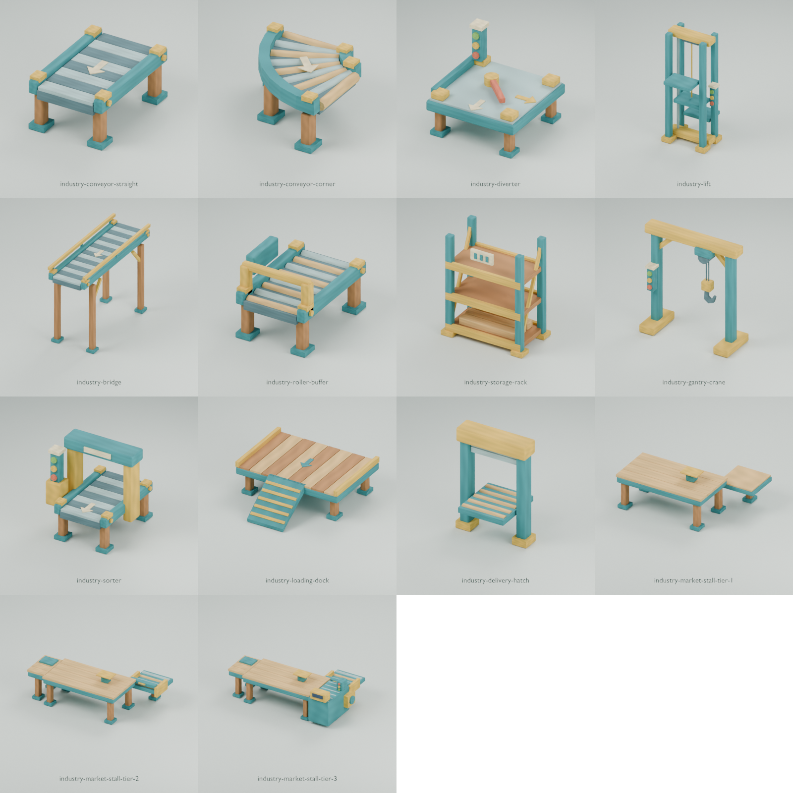

# Industrie forestière lumineuse

Cette bibliothèque contient 14 modules originaux pour les chaînes de production, le stockage et les postes de vente de Slopfarm.

Les châssis turquoise, les protections jaunes et les plateaux en bois relient visuellement les machines. Les flèches et les voyants rendent les flux visibles.



## Catalogue prêt à intégrer

Chaque identifiant correspond à un fichier `.glb` dans ce dossier. Le manifeste utilise `family: "industry"` et `kind: "prop"`.

| Identifiant                    | Triangles | Usage                                                       |
| ------------------------------ | --------: | ----------------------------------------------------------- |
| `industry-conveyor-straight`   |       956 | Convoyeur droit de 2 m avec flèche de flux.                 |
| `industry-conveyor-corner`     |       888 | Virage à rouleaux courbes, avec sortie à droite.            |
| `industry-diverter`            |     1 440 | Jonction à deux sorties, palette d’aiguillage et voyants.   |
| `industry-lift`                |     1 588 | Élévateur à guides, treuil et plateau intermédiaire.        |
| `industry-bridge`              |     1 196 | Convoyeur surélevé de 4 m avec garde-corps.                 |
| `industry-roller-buffer`       |     1 528 | Buffer à rouleaux avec butée et jauge de capacité.          |
| `industry-storage-rack`        |     1 080 | Rack industriel à trois étagères et stock de planches.      |
| `industry-gantry-crane`        |     1 096 | Petit portique-grue avec chariot, câbles et crochet ouvert. |
| `industry-sorter`              |     1 604 | Trieuse à portique de lecture et trois voyants.             |
| `industry-loading-dock`        |     1 024 | Quai en bois avec châssis métallique et rampe.              |
| `industry-delivery-hatch`      |       548 | Trappe arrière à volet relevé et plateau à rouleaux.        |
| `industry-market-stall-tier-1` |     1 128 | Comptoir manuel ouvert et réception arrière.                |
| `industry-market-stall-tier-2` |     1 816 | Double service et trappe basse à rouleaux.                  |
| `industry-market-stall-tier-3` |     2 464 | Distribution latérale automatisée et caisse.                |

La bibliothèque totalise 18 356 triangles. Chaque module reste sous le budget de 2 500 triangles.

Le [guide des échoppes ouvertes](market-stalls.md) décrit leur placement et leurs preuves de visibilité avec les piles du jeu.

Chaque GLB contient un seul maillage statique, une seule primitive et le matériau `forest-painted-matte`. L’atlas opaque intégré mesure 1024 × 1024 pixels.

Les mécanismes sont représentés dans une pose fixe. Les points d’attache repèrent les emplacements de chargement, de lecture et de service.

Associez la trieuse et la jonction pour représenter un tri à deux sorties.

## Accessoires universels conservés

Les accessoires suivants complètent les modules industriels :

- `camp-log-pile` et `camp-plank-pile` fournissent les stocks au sol.
- `camp-cart` sert aux transports manuels.
- `camp-crate` et `camp-barrel` occupent les zones de stockage et les quais.
- `camp-awning` couvre un poste d’ouvrier ou une extension de vente.

Le [catalogue des accessoires](camp-library.md) conserve leurs dimensions et leurs points d’attache. La [planche générale](contact-sheet.png) rassemble les 56 modèles.

## Repères et raccords

Les unités sont des mètres. L’axe vertical est `+Y` et l’avant des échoppes est `+Z`.

Les modules industriels utilisent `origin: "module-anchor"`. Leur origine reste au repère de construction, au niveau du sol.

Conservez cette origine pendant l’assemblage. Les volumes asymétriques ne sont pas recentrés sur leurs limites.

Le champ `sockets` contient les positions locales des points d’attache. Le champ `ports` identifie les raccords de transport.

Chaque raccord possède une largeur utile `widthMeters: 1` et une direction extérieure `direction`. Les directions sont exprimées dans le repère glTF.

Les coordonnées ci-dessous suivent l’ordre `[X, Y, Z]` :

| Module                           | Entrée `input`      | Sortie `output`                                     |
| -------------------------------- | ------------------- | --------------------------------------------------- |
| Convoyeur droit, buffer, trieuse | `[0, 0.8, -1]`      | `[0, 0.8, 1]`                                       |
| Virage                           | `[0, 0.8, -1]`      | `[1, 0.8, 0]`                                       |
| Jonction                         | `[0, 0.8, -1]`      | `[0, 0.8, 1]`                                       |
| Élévateur                        | `[0, 0.8, -1]`      | `[0, 2.6, 1]`                                       |
| Pont surélevé                    | `[0, 2.6, -2]`      | `[0, 2.6, 2]`                                       |
| Quai                             | `[0, 0.8, -1]`      | Le point `cargo` repère la zone de dépôt.           |
| Trappe arrière                   | `[0, 0.8, -0.6]`    | `[0, 0.8, 0.6]`                                     |
| Échoppes ouvertes                | `[1.55, 0.8, -1.7]` | Le point `delivery` repère la réception intérieure. |

La jonction possède aussi `output-right` à `[1, 0.8, 0]`. Les sorties latérales pointent vers `+X`.

Les entrées pointent vers `-Z`. Les sorties droites pointent vers `+Z`.

Pour raccorder deux modules :

1. Orientez leurs directions de raccord en sens opposés.
2. Superposez les positions mondiales de leurs points d’attache.
3. Conservez une échelle uniforme de 1 pour respecter les dimensions du catalogue.

### Assemblages vérifiés

Cette chaîne utilise une rotation nulle pour chaque module :

| Module                         | Position de son origine |
| ------------------------------ | ----------------------- |
| `industry-conveyor-straight`   | `[0, 0, 0]`             |
| `industry-roller-buffer`       | `[0, 0, 2]`             |
| `industry-sorter`              | `[0, 0, 4]`             |
| `industry-market-stall-tier-1` | `[-1.55, 0, 6.70]`      |

Un virage à l’origine rejoint un convoyeur droit placé à `[2, 0, 0]`, avec une rotation de `+90°` autour de `Y`.

Un élévateur à l’origine rejoint un pont placé à `[0, 0, 3]`. Leurs raccords se trouvent à 2,60 m de hauteur.

Le validateur contrôle ces cinq liaisons, leurs positions et leurs directions opposées.

### Points d’attache complémentaires

| Module        | Points d’attache                                                                                        |
| ------------- | ------------------------------------------------------------------------------------------------------- |
| Jonction      | `switch` repère le pivot d’aiguillage.                                                                  |
| Élévateur     | `platform` repère le plateau intermédiaire, à 1,60 m.                                                   |
| Pont          | `passage` repère la traversée au sol.                                                                   |
| Buffer        | `storage` repère le centre du plateau.                                                                  |
| Rack          | `storage-1`, `storage-2` et `storage-3` repèrent les étagères à 0,25 m, 1,10 m et 1,95 m.               |
| Portique-grue | `hook` repère le crochet. `load` repère sa projection au sol.                                           |
| Trieuse       | `scanner` repère la zone de lecture.                                                                    |
| Quai          | `cargo` repère le dépôt. `approach` repère l’accès à la rampe.                                          |
| Trappe        | `mount` repère le centre de fixation au sol.                                                            |
| Échoppe       | `delivery`, `sale`, `worker` et `customer` repèrent la réception, la vente et les positions de service. |

Les niveaux 2 et 3 intègrent une trappe basse rabattue. Les colonnes de stock restent ouvertes au-dessus du comptoir.

## Sources et direction visuelle

La génération industrielle se trouve dans `scripts/blender/industry_props.py`. Les trois échoppes proviennent de `scripts/blender/market_stalls.py`.

Les formes utilisent les primitives et l’atlas du projet. Aucun modèle ni aucune texture externe ne participe à la génération.

Les références du projet sont :

- [Vue générale industrielle](../../art/concepts/base-industrial-master-v2.png).
- [Automatisation et logistique](../../art/concepts/base-automation-logistics.png).
- [Marché industrialisé](../../art/concepts/base-industrial-market-v2.png).

## Commandes

Depuis la racine du dépôt, générez et validez deux exports indépendants :

```sh
nix develop .#assets --command bash scripts/blender/pipeline.sh --verify-reproducible
```

Validez les GLB existants :

```sh
nix develop .#assets --command blender --background --factory-startup --threads 1 \
  --python-exit-code 1 --python scripts/blender/validate_forest.py
```

Générez les 14 aperçus industriels et leur planche :

```sh
nix develop .#assets --command blender --background --factory-startup --threads 1 \
  --python-exit-code 1 --python scripts/blender/render_forest.py -- --family industry --size 400
```

Assemblez la planche générale depuis les aperçus existants :

```sh
nix develop .#assets --command blender --background --factory-startup --threads 1 \
  --python-exit-code 1 --python scripts/blender/render_forest.py -- --sheet-only --size 320
```

Le rapport `validation-report.json` contient les contrôles GLB, les budgets, les conventions, la réimportation Blender et la comparaison des exports.
