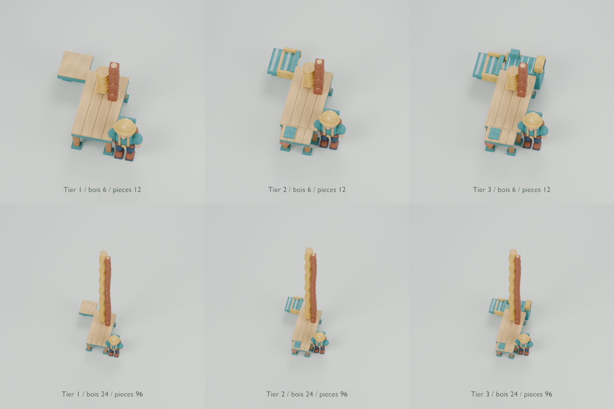

# Échoppes ouvertes et stock visible

Les trois niveaux remplacent l’ancien modèle couvert. Le comptoir central reste ouvert verticalement et sur ses faces de service.



## Modèles prêts à intégrer

Les dimensions suivent les axes locaux glTF : largeur `X`, hauteur `Y`, profondeur `Z`.

| Fichier                            | Dimensions en mètres  | Triangles | Équipement                                                       |
| ---------------------------------- | --------------------- | --------: | ---------------------------------------------------------------- |
| `industry-market-stall-tier-1.glb` | 3,420 × 1,250 × 2,410 |     1 128 | Comptoir manuel et réception arrière ouverte.                    |
| `industry-market-stall-tier-2.glb` | 4,080 × 1,250 × 2,410 |     1 816 | Second service latéral et trappe arrière rabattue avec rouleaux. |
| `industry-market-stall-tier-3.glb` | 4,340 × 1,325 × 2,619 |     2 464 | Distribution latérale, moteur, caisse et trois voyants.          |

Chaque modèle reste sous 2 500 triangles. Les trois modèles totalisent 5 408 triangles.

Les fichiers utilisent `family: "industry"`, `module: "market-stall"` et `tier: 1`, `2` ou `3`.

Chaque fichier contient un maillage statique, une primitive et le matériau partagé `forest-painted-matte`. L’atlas opaque mesure 1024 × 1024 pixels.

## Placement dans le jeu

L’origine `module-anchor` reste au sol. Les limites sont asymétriques, car les améliorations occupent les côtés et l’arrière.

Placez l’origine à `MARKET_TABLE`. Appliquez une rotation de `+90°` autour de `Y`. Conservez une échelle de `1`.

Le placement correspond à `game-view.ts`. Le stock et les pièces conservent leurs coordonnées mondiales, indépendantes de la rotation du modèle.

| Point d’attache | Coordonnées locales `[X, Y, Z]` | Usage                                          |
| --------------- | ------------------------------- | ---------------------------------------------- |
| `stock`         | `[0.42, 0.99, 0.35]`            | Surface sous la pile de bois.                  |
| `coins`         | `[0.57, 1.25, 0]`               | Surface sous la pile de pièces.                |
| `input`         | `[1.55, 0.8, -1.7]`             | Raccord arrière décalé, largeur utile de 1 m.  |
| `delivery`      | `[1.55, 0.8, -0.8]`             | Réception intérieure du convoyeur.             |
| `sale`          | `[-0.55, 0.99, -0.45]`          | Premier poste de service.                      |
| `worker`        | `[-1.05, 0, 1.1]`               | Position du vendeur.                           |
| `customer`      | `[0, 0, -1.65]`                 | Accès client correspondant à la file actuelle. |
| `service-2`     | `[-1.64, 1.04, -0.24]`          | Second poste, niveaux 2 et 3.                  |
| `customer-2`    | `[-1.1, 0, -1.65]`              | Second accès client, niveaux 2 et 3.           |
| `distribution`  | `[1.75, 1.01, 0.4]`             | Sortie du distributeur, niveau 3.              |
| `register`      | `[1.77, 1.31, 0.73]`            | Caisse latérale, niveau 3.                     |

Après rotation, `stock` correspond à `[0.35, 0.99, -0.42]` par rapport à `MARKET_TABLE`. Le premier bloc est centré à 1,14 m.

Après rotation, `coins` correspond à `[0, 1.25, -0.57]`. Le plateau évite l’emprise du bois et soutient les pièces par leur partie arrière.

Le raccord arrière est décalé latéralement pour dégager l’accès client. Le catalogue fournit sa direction extérieure dans `ports.input.direction`.

## Contrat de visibilité

Le contrôle lit les valeurs actuelles dans cinq fichiers du jeu :

- `src/app/camera-layout.ts` fournit la caméra orthographique : décalage `(3.2, 20, 14)`.
- `src/presentation/game-view.ts` fournit la rotation et la pile de stock physique.
- `src/presentation/resource-view.ts` fournit les dimensions du bois et l’échelle des pièces.
- `src/presentation/market-stock-layout.ts` fournit le placement visuel des pièces et leur pas vertical.
- `src/game/stack-layout.ts` fournit les décalages et les rotations des éléments.

Les colonnes réservées au bois et aux pièces n’ont aucune limite supérieure. Le validateur recherche les triangles qui traversent ces volumes.

Le validateur teste aussi 3 203 rayons par modèle depuis la direction de caméra. Ils couvrent 128 unités de bois, 512 pièces et le vendeur.

Les volumes du vendeur et des accès clients restent libres jusqu’à 2,10 m. Le contrôle porte sur une emprise de 0,70 × 0,70 m.

Trois tests de régression ajoutent volontairement des obstacles :

- Un toit à 60 m vérifie que la colonne reste ouverte au-delà de la pile maximale.
- Un panneau hors de la colonne vérifie la détection des occultations depuis la caméra.
- Un obstacle dans l’accès client vérifie son dégagement.

## Aperçus et preuves

La [planche des modèles seuls](contact-sheet-market-stall.png) présente les trois silhouettes.

La [planche de stock](contact-sheet-market-stock.png) conserve la direction réelle de caméra et la rotation de 90° du marché.

- La première ligne montre 6 unités de bois et 12 pièces.
- La seconde ligne montre 24 unités de bois et 96 pièces.
- Les piles hautes culminent à environ 8,21 m et 8,49 m.
- Le vendeur utilise le GLB `worker`, à l’échelle 0,8.
- Le cadrage orthographique englobe chaque assemblage pour montrer toute la pile.

Les ressources et le vendeur servent uniquement aux aperçus. Les GLB des échoppes contiennent uniquement leur équipement fixe.

Le fichier `market-stock-preview.json` enregistre les valeurs lues dans le jeu et les scénarios affichés.

## Génération et vérification

Depuis la racine du dépôt, générez et validez deux exports indépendants :

```sh
nix develop .#assets --command bash scripts/blender/pipeline.sh --verify-reproducible
```

Générez les aperçus des trois modèles :

```sh
nix develop .#assets --command blender --background --factory-startup --threads 1 \
  --python-exit-code 1 --python scripts/blender/render_forest.py -- --module market-stall --size 400
```

Générez la preuve avec les piles et la caméra du jeu :

```sh
nix develop .#assets --command blender --background --factory-startup --threads 1 \
  --python-exit-code 1 --python scripts/blender/render_market_stalls.py
```

Exécutez les tests d’occultation :

```sh
nix develop .#assets --command blender --background --factory-startup --threads 1 \
  --python-exit-code 1 --python scripts/blender/test_market_visibility.py
```

Le contrôle Nix `checks.assets` inclut la réimportation, les vérifications de visibilité et les trois tests de régression.
